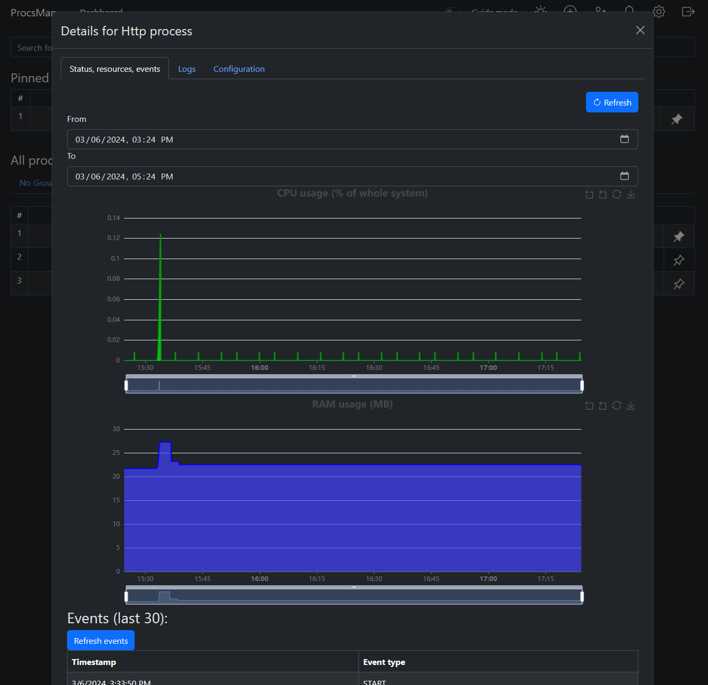
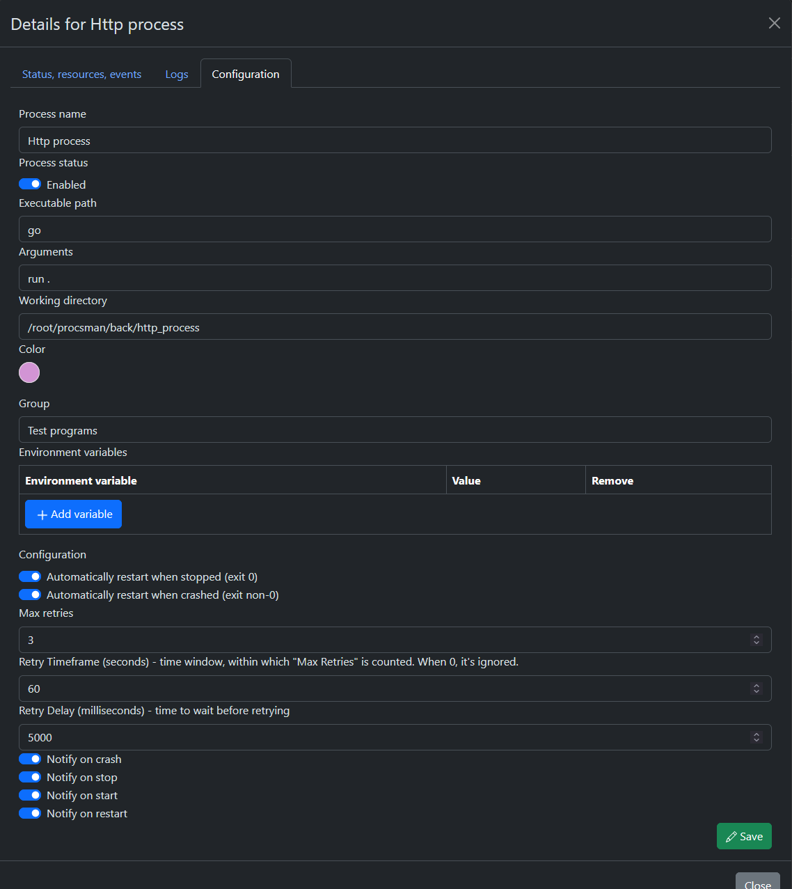
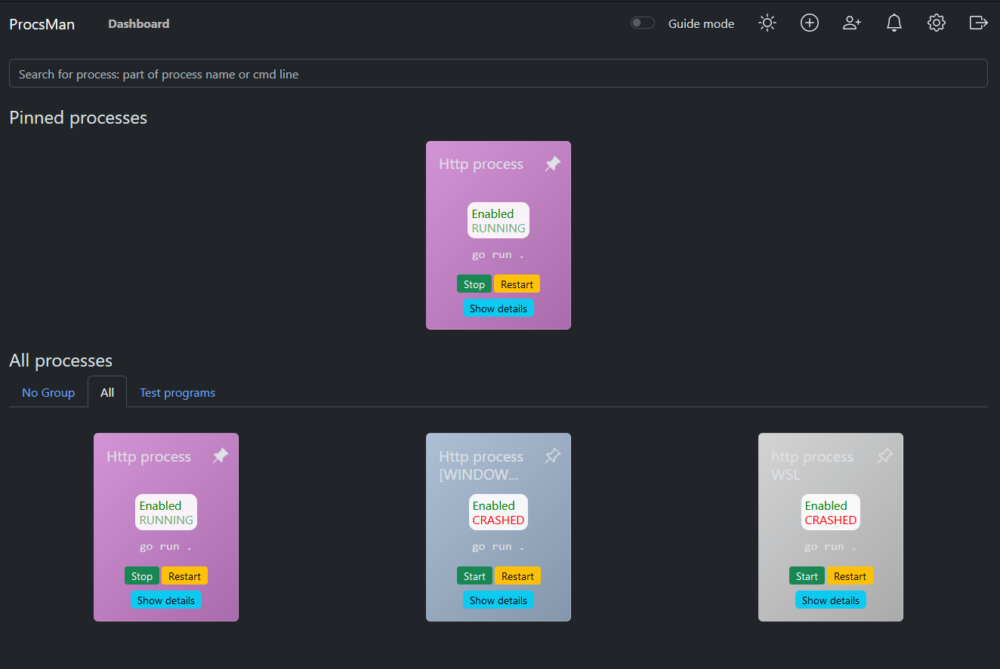

# ProcsManager 🛠️

**ProcsManager** is a user-friendly tool designed for both Linux and Windows environments, perfect for managing your processes added via the web interface. It's not just about handling what's running on your server but bringing under control those specially added processes. Dive into management effortlessly with its Go-based backend and React-powered frontend.

## Features 🌟

- **Web Interface**: A straightforward web interface to oversee your processes.
- **Process Management**: Start, stop, restart, and kill processes seamlessly.
- **Configuration Flexibility**: Tweak environment variables, arguments, and the working directory to your needs.
- **Monitoring**: Keep an eye on historical CPU and memory usage of all processes.
- **Logging**: Access detailed logs for a clear overview of process activities.
- **Resilience**: Auto-restart capabilities for processes that fail unexpectedly.
- **Notifications**: Get Telegram alerts instantly on process failures.
- **Grouping**: Organize your processes into groups for better management, with settings inheritance.
- **Languages**: Supports both English and Russian, catering to diverse user bases.
- **Themes**: Choose between dark and light modes for your visual comfort.
- **Prioritization**: Pin the most critical processes to the top for quick access.

## Cloning the Repository 📦
You have to use `--recurse-submodules` flag to clone the repository, because it contains submodules. 
```bash
git clone --recurse-submodules
````

## Screenshots 📸
<details>
<summary>📸 Click to see screenshots</summary>
    Main view
    
    Process view
    
    Process edit
    
    Card mode (perfect for mobile use)
    
</details>

## Installation 🛠️

Before diving into the setup, make sure to edit the following configuration files:

Here are the files you need to edit:
1. `config.json` - main configuration file:
```json5
{
  "db": "postgresql://usernameChangeMe:passwordChangeMe@db:5432/procsman", // Database connection string. Leave as is, if running in docker
  "logs_folder": "logs", // Folder to store logs. Leave as is, if running in docker
  "log_file_timespan": 3600, // How much time will each log file store in seconds
  "flush_interval": 1000, // How often to flush logs to disk in milliseconds
  "process_stats_interval": 10 // How often to collect process stats in seconds
}
```
2. `default_process_config.json` - default process configuration:
```json5
{
  "auto_restart_on_stop": true, // Auto-restart process on stop
  "auto_restart_on_crash": true, // Auto-restart process on crash
  "auto_restart_max_retries": 3, // How many times to try to restart process
  "auto_restart_max_retries_frame": 60, // Time frame to restart process in seconds (if process crashes more often than auto_restart_max_retries within this time frame, it will not be restarted)
  "auto_restart_delay": 5000, // Delay between restarts in milliseconds
  "notify_on_start": true, // Send notification on process start
  "notify_on_stop": true, // Send notification on process stop
  "notify_on_crash": true, // Send notification on process crash
  
  // WIP, does not work at the moment!! All process logs and stats will be recorded regardless of this setting
  "record_stats": true, // Record process stats
  "store_logs": true // Store process logs
}
```

3. `notifications.json` - telegram notifications configuration: (you don't have to edit it here, you'll be able to do this from the web interface)
```json5
{
  "enabled": true,
  "telegram_bot_token": "",
  "telegram_target_chat_ids": []
}
```

### Source Code Update 🔄
Keep your application up-to-date with these simple commands:
```bash
git pull
git submodule update --init --recursive --remote
# stop and remove old containers
docker-compose down
# delete old images of frontend and backend
docker rmi procsman_docker-frontend procsman_docker-backend
# rebuild and start new containers
docker-compose up --build -d
```

### Docker 🐳
Is easier in installation (e.g. if you want to check it out), but you'll have to provide volumes for your processes.

1. In `docker-compose.yml` in `backend` section: provide the volumes for whatever you want to run. For example, if you want to run a simple `ls` command, you can provide the volume like this:
```yaml
    volumes:
      - /bin:/app/bin
      - /my_folder:/app/my_folder
```
so that you could run processes like:
`/app/bin/my_super_script.sh /app/my_folder/my_super_folder`
By default, web interface will be available at `http://localhost:17466`, and backend at `http://localhost:54580`.

If you want to be able to access this service from outside of your machine, I recommend you to use nginx or something similar to proxy requests to this service.

Don't forget to change `REACT_APP_API_ENDPOINT` in docker-compose.yml -> frontend and set it to public URL of backend. (e.g. `https://example.com:54580`)
2. Run `docker-compose up -d`
3. Get your key from `auth.json` and use it to log in.


### Manual Setup 🛠️
Dependencies:
- Go 1.22+
- Node.js 14+ with npm
- PostgreSQL 12+
- serve (`npm install -g serve`)

1. Install frontend dependencies:
```bash
cd front
npm install
```

2. Build frontend:
```bash
npm run build
```

3. Install backend dependencies:
```bash
cd ../back
go mod download
```

4. Build backend:
```bash
go build
```

5. Install and configure PostgreSQL, and run sql from `back/sqls/schema.sql` to create the database.
6. Populate configuration files, as described above.
7. Run backend:
```bash
./procsman_backend
```

8. Run frontend:
```bash
cd ../front
serve -s build -l 17466
```

**Enjoy seamless process management with ProcsManager! Your go-to solution for keeping things tidy and efficient.** 🚀