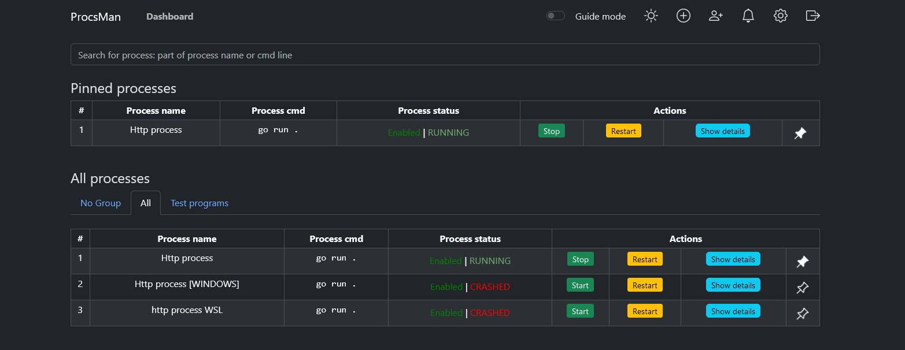

## ProcsManager

ProcsManager is a simple tool to manage processes in a Linux/Windows environment.

The backend is written in go, frontend in react.

## Features
- A simple web interface to manage processes
- Start, stop, restart, and kill processes
- Configure environment variables, arguments, and working directory
- View historical process CPU and memory usage
- View logs of processes
- Auto-restart processes on failure
- Send notifications in telegram on process failure
- Separate processes into groups (with inheritance of settings)
- Both English and Russian languages are supported
- Dark and light themes
- Pin important processes to the top of the list

<details>
<summary>Click to see screenshots</summary>
    Main view
    
    Process view
    
    Process edit
    
    Card mode (targeted for mobile devices)
    
</details>

## Installation
Regardless of the method (docker or manual), you need to populate configuration files.

Here are the files you need to edit:
1. `config.json` - main configuration file:
```json5
{
  "db": "postgresql://usernameChangeMe:passwordChangeMe@db:5432/procsman", // Database connection string. Leave as is, if running in docker
  "logs_folder": "logs", // Folder to store logs. Leave as is, if running in docker
  "log_file_timespan": 3600, // How much time will each log file store in seconds
  "flush_interval": 1000, // How often to flush logs to disk in milliseconds
  "process_stats_interval": 10 // How often to collect process stats in seconds
}
```
2. `default_process_config.json` - default process configuration:
```json5
{
  "auto_restart_on_stop": true, // Auto-restart process on stop
  "auto_restart_on_crash": true, // Auto-restart process on crash
  "auto_restart_max_retries": 3, // How many times to try to restart process
  "auto_restart_max_retries_frame": 60, // Time frame to restart process in seconds (if process crashes more often than auto_restart_max_retries within this time frame, it will not be restarted)
  "auto_restart_delay": 5000, // Delay between restarts in milliseconds
  "notify_on_start": true, // Send notification on process start
  "notify_on_stop": true, // Send notification on process stop
  "notify_on_crash": true, // Send notification on process crash
  
  // WIP, does not work at the moment!! All process logs and stats will be recorded regardless of this setting
  "record_stats": true, // Record process stats
  "store_logs": true // Store process logs
}
```

3. `notifications.json` - telegram notifications configuration: (you don't have to edit it here, you'll be able to do this from the web interface)
```json5
{
  "enabled": true,
  "telegram_bot_token": "",
  "telegram_target_chat_ids": []
}
```

#### Updating source code:
```bash
git pull
git submodule update --init --recursive --remote
# stop and remove old containers
docker-compose down
# delete old images of frontend and backend
docker rmi procsman_frontend procsman_backend
# rebuild and start new containers
docker-compose up --build -d
```

### Docker

Is easier in installation (e.g. if you want to check it out), but you'll have to provide volumes for your processes.

1. In `docker-compose.yml` in `backend` section: provide the volumes for whatever you want to run. For example, if you want to run a simple `ls` command, you can provide the volume like this:
```yaml
    volumes:
      - /bin:/app/bin
      - /my_folder:/app/my_folder
```
so that you could run processes like:
`/app/bin/my_super_script.sh /app/my_folder/my_super_folder`
By default, web interface will be available at `http://localhost:17466`, and backend at `http://localhost:54580`.

If you want to be able to access this service from outside of your machine, I recommend you to use nginx or something similar to proxy requests to this service.

Don't forget to change `REACT_APP_API_ENDPOINT` in docker-compose.yml -> frontend and set it to public URL of backend. (e.g. `https://example.com:54580`)
2. Run `docker-compose up -d`
3. Get your key from `auth.json` and use it to log in.


### Manual
Dependencies:
- Go 1.22+
- Node.js 14+ with npm
- PostgreSQL 12+
- serve (`npm install -g serve`)

1. Install frontend dependencies:
```bash
cd front
npm install
```

2. Build frontend:
```bash
npm run build
```

3. Install backend dependencies:
```bash
cd ../back
go mod download
```

4. Build backend:
```bash
go build
```

5. Install and configure PostgreSQL, and run sql from `back/sqls/schema.sql` to create the database.
6. Populate configuration files, as described above.
7. Run backend:
```bash
./procsman_backend
```

8. Run frontend:
```bash
cd ../front
serve -s build -l 17466
```

Done.